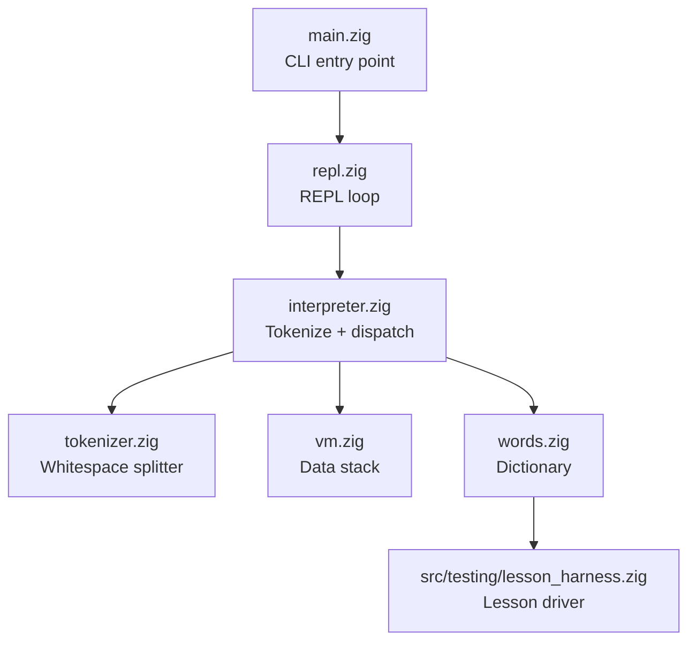

# Zorth, learning zig

This is my attempt to learn the Zig programming language by creating a simple command line tool called Zorth.
Zorth is a minimalistic Forth-like interpreter implemented in Zig.
I've had the lessons built up by Codex, including some minimal scaffolding.

